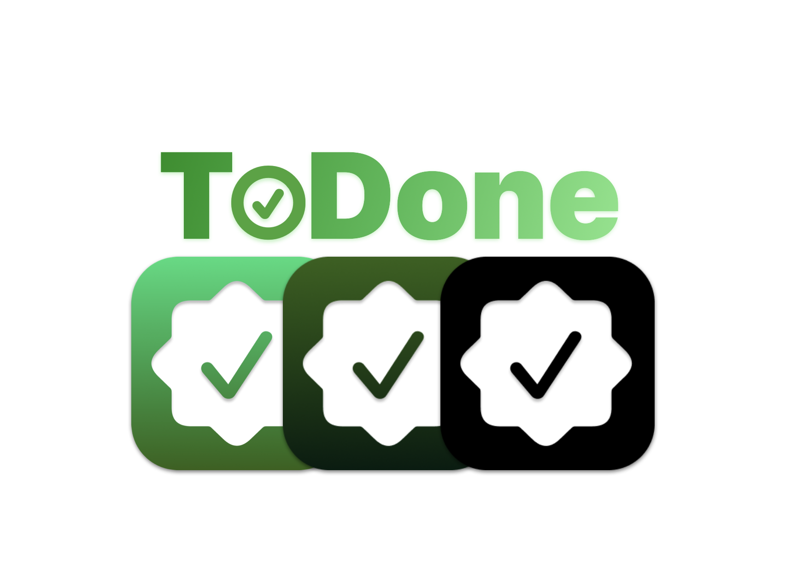

# ToDone 📋

## Descripción

**ToDone** es una aplicación de iOS creada por **Teo Aranda** y **Xavier Moreno**, diseñada para ayudarte a organizar y gestionar tus tareas de manera eficiente y visual. Con ToDone, puedes:

- Añadir nuevas tareas 📝  
- Marcar tareas como completadas ✅  
- Filtrar tus tareas por estado: completadas o pendientes 🔍  
- Eliminar tareas innecesarias 🗑️  
- Visualizar tus tareas en gráficos interactivos 📊  

¡Mantén tu productividad al máximo con esta herramienta intuitiva y poderosa!

---

## Características principales

1. **Interfaz amigable**: Diseñada para una experiencia de usuario fluida y rápida.  
2. **Gestión de tareas**: Fácil de añadir, marcar como completadas y eliminar tareas.  
3. **Filtros personalizables**: Visualiza solo las tareas que te interesan.  
4. **Gráficos dinámicos**: Obtén una visión clara de tu progreso en tareas completadas y pendientes.  
5. **Compatibilidad**: Exclusiva para dispositivos iOS 18+.

---

